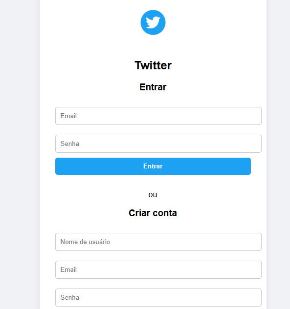
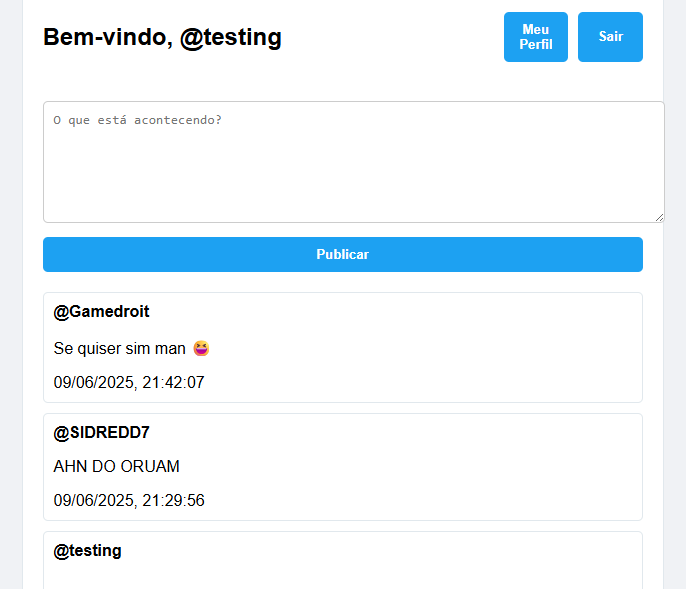
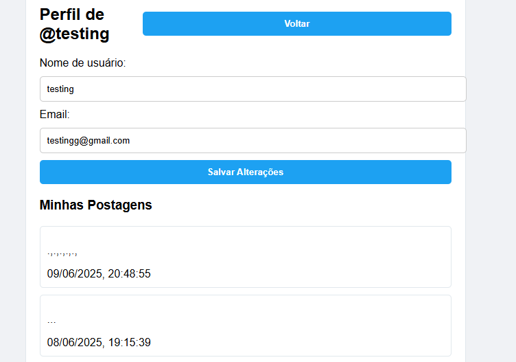

# 🐦 Mini Twitter

Um clone simplificado do Twitter, desenvolvido com HTML, CSS e JavaScript, integrando com uma API para autenticação, postagens e gerenciamento de perfil.

---

## 🚀 Funcionalidades

- ✅ Registro e login de usuários
- 📝 Criação e visualização de postagens
- 🙍‍♂️ Visualização e edição do perfil do usuário
- 🔒 Autenticação com JWT
- 📱 Interface responsiva

---

## 📷 Screenshots

### 🏠 Página de Login / Registro


### 📰 Feed de Postagens


### 🙍‍♂️ Tela de Perfil


---

## 🛠️ Instalação

### Pré-requisitos:
- Navegador moderno (Chrome, Firefox, Edge, etc.)
- Editor de código (recomendado: VS Code)
- Acesso à internet (para consumir a API hospedada)

### Passos:

1. Clone o repositório:
```bash
git clone https://github.com/Leandro-Oli2/MiniTwitter.git
